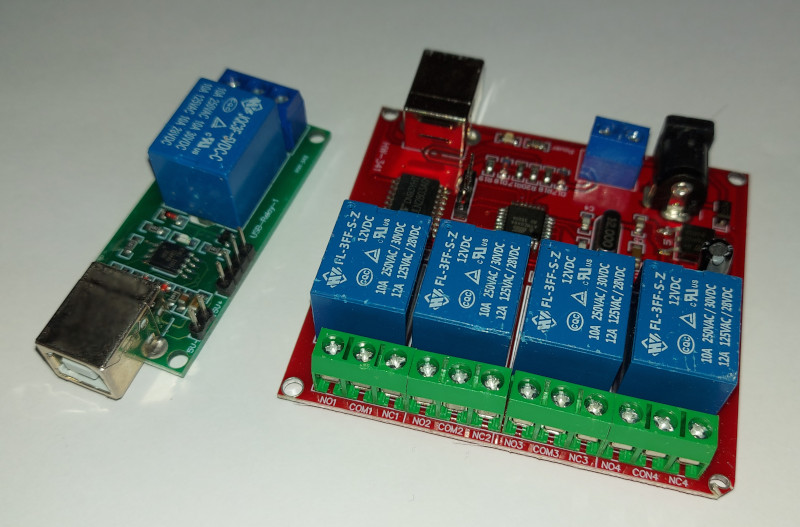

# USBRelay

USBRelay is a C++ header-only library for managing USB electrical relay modules, distributed under the MIT License.
USBRelay is built over the HIDAPI interface, and requires that HIDAPI libraries/headers for deploy and development.



USB relay boards are based on DCT Technology. Each board carries from 1 to 8 relay switches which may be operated independently.
Each DCT-compatible board has a EEPROM where a 5 character identifier (user serial) may be stored by user and read back later in order to identify the board.
Using USBRealy to control relays may be as simple as this:
```
#include <iostream>
#include "usbrelay.h"

int main() 
{
    std::vector<USBRelay::USBRelayBoard> boards = USBRelay::USBRelayBoard::enumerateKnownBoards();
    if (boards.size() > 0) {
        std::cout << boards.size() << " USB relay boards found!" << std::endl;
        std::cout << "First board has " << boards.front().relayCount() << " relays." << std::endl;
        std::cout << "Setting the first relay on the first board to the ON state." << std::endl;
        boards.front().relayOn(0);
    } else {
        std::cout << "No USB relay boards found!" << std::endl;
    }
    return EXIT_SUCCESS;
}
```
